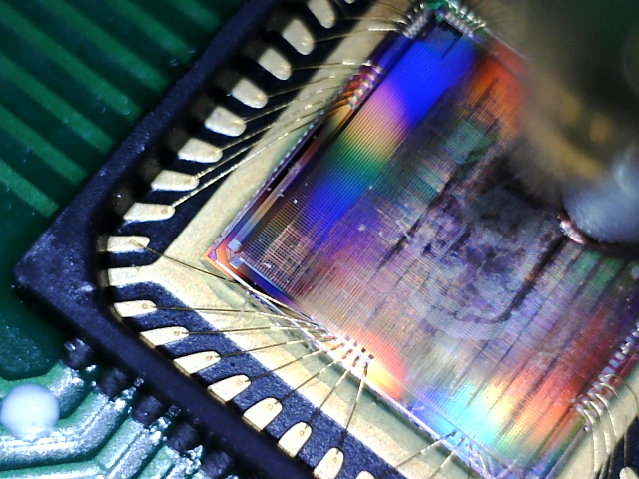
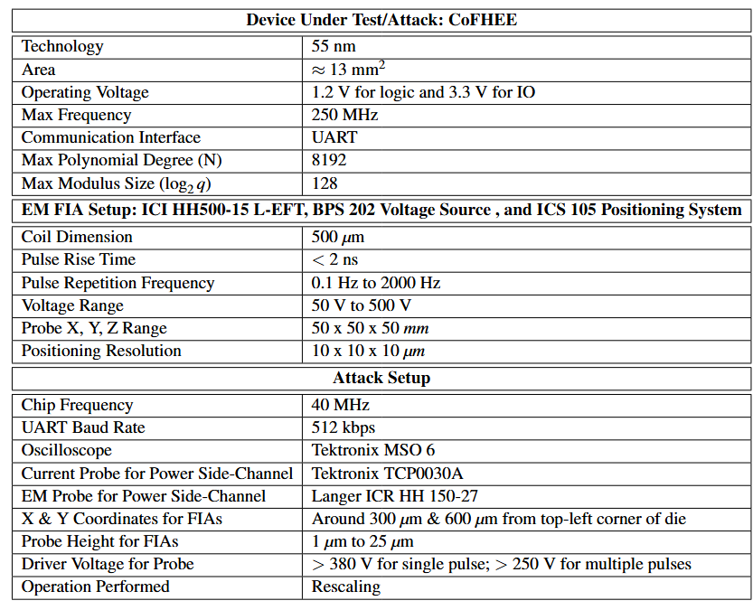

# __GlitchFHE - Attacking Fully Homomorphic Encryption Using Fault Injection__



## __Big Picture__

GlitchFHE enables controlled fault injection during FHE evaluation operations, allowing to study the security promises of FHE in terms of data integrity. A key objective is to
minimize the mean squared error (MSE) of the decrypted ciphertext relative to that obtained without fault injection, to maintain relative stealthiness of the attack.
Thus, the main challenge addressed by GlitchFHE is determining the optimal operation and magnitude of the fault injection to achieve low MSE.

In this repository, we provide both the software framework and the hardware framework used by GlitchFHE.

GlitchFHE is accepted for publication at USENIX Security'25.
<!--
If you wish to acknowledge or reference our work, please use the citation below:
-->

## __GlitchFHE Software Framework__

The directory [Software-Experiments](Software-Experiments) contains all the codes and corresponding documentation for the software-based experiments on:
- CKKS and BFV implementations of polynomial evaluation
- CKKS and BFV implementations of image classification
- CKKS implementation of image processing

## __GlitchFHE Hardware Framework__

The hardware framework contains 
- Basic setup details of the representative FHE accelerator under attack, [CoFHEE](https://github.com/momalab/CoFHEE). This includes how to interface with the host computer, voltage/clock requirements, etc.
- Python APIs to execute various polynomial operations in CoFHEE. The idea is to inject faults during these API calls.
- There are also custom functions that can be used just to load and read back the polynomials to/from the internal SRAM memory. They're useful to find the right probe position in (x, y, z) dimension that enables injecting the desired faults into the polynomials loaded in the memory (by injecting the fault after loading data into the memory, reading data back to check if it's corrupted and the degree of corruption).
- Description of the representative setup for electromagnetic-based fault injection attacks

### __Interfacing with CoFHEE chip__
#### __UART interface__

We used the UART interface of CoFHEE to interact with the host PC. We used FTDI's [UM232R development board](https://ftdichip.com/wp-content/uploads/2020/08/DS_UM232R.pdf) for USB to UART protocol conversion. 

#### __Clock, Reset, and Voltage Supply__

In addition to USB-to-UART communication, the clock and I/O voltage of 3.3V required for CoFHEE are also sourced from the UM232R development board.
And, one of the GPIO pins of the UM232R board can be used to control the reset pin of CoFHEE.
For the 1.2V core voltage supply, we used a simple [USB DC-DC converter](https://a.co/d/jcYxmFo).

#### __[Python APIs](CoFHEE_API)__
##### __Important Files__
- [CoFHEE Memory Map](CoFHEE_API/CoFHEE_header.py)
- Files to update for FTDI parameters, if deviating from our representative setup.
   - Update CBUS# used as gpio to reset CoFHEE in [CoFHEE_API/reset.c](CoFHEE_API/reset.c)
   - Update VID/PID in [CoFHEE_API/reset.c](CoFHEE_API/reset.c)
   - Update ser.port and ser.baudrate in files [CoFHEE_API/boost_baudrate.py](CoFHEE_API/boost_baudrate.py) and [CoFHEE_API/CoFHEE_tasks.py](CoFHEE_API/CoFHEE_tasks.py).
- [CoFHEE Reset](CoFHEE_API/reset.c): Compile and execute this code for proper reset handling of CoFHEE.
   
##### __Important Functions__

All the main functions to perform polynomial-level operations (like NTT, iNTT, HadamardMul, PwiseAdd, or PwiseSub) and high-level operations like polynomial multiplication, rescale, etc are orchestrated in [CoFHEE_API/CoFHEE_tasks.py](CoFHEE_API/CoFHEE_tasks.py). Key functions are described next, and also refer to [CoFHEE documentation](https://arxiv.org/abs/2204.08742) for more details.
 - fhe_rescale_mod (all_pre_tow, qi,    N,   addri, scratch_addr, towL_twiddle_addr): to perform rescale operation when the polynomials are stored in iNTT format
 - fhe_rescale_ntt_mod (all_pre_tow, qi,    N,   addri, scratch_addr, towL_twiddle_addr): to perform rescale operation when the polynomials are stored in NTT format
 - fault_load_coeff (poly, q, N): to load the polynomials to internal SRAM with respect to the base address in [CoFHEE_header.FHEMEM5_BASE](CoFHEE_API/CoFHEE_header.py)
 - fault_load_read_full_range (poly, k, N): to read back the data from the SRAM with base address [CoFHEE_header.FHEMEM5_BASE](CoFHEE_API/CoFHEE_header.py)
 
##### __Pseudo Code to Detect Probe Position for Successful Fault Injection__
```text
while (No fault detected):
    Load seal_coeffs.coeff1 to internal SRAM:
        CoFHEE_main.CoFHEE_tasks.fault_load_coeff(seal_coeffs.coeff1, 1099510890497, 8192)

    Manually change the probe’s voltage and/or (x, y, z) coordinates

    Read back seal_coeffs.coeff1 from internal SRAM:
        CoFHEE_main.CoFHEE_tasks.fault_load_read_full_range(seal_coeffs.coeff1, 0, 8192)
```
#### __Physical Attack Setup__


## License
You can use our codes under the [GPLv3 license](https://www.gnu.org/licenses/gpl-3.0.en.html). 
